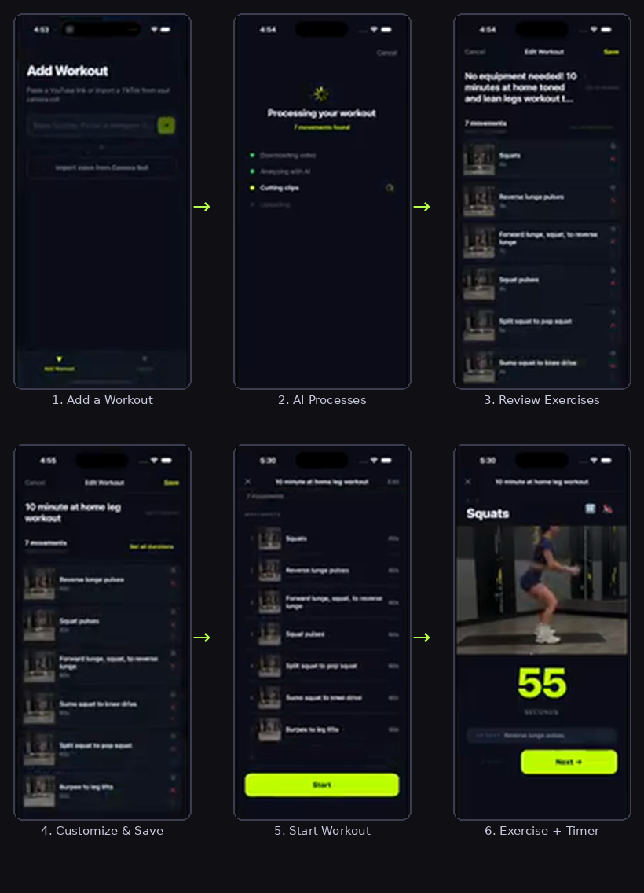

# Tempo

Tempo turns a workout — however it's captured — into an interactive, movement-by-movement training session.

Paste a YouTube, TikTok, Instagram, or Facebook link; type in instructions ("hold 6 seconds, repeat 6 times, 3 sets"); or upload a video, a PDF exercise sheet, or a photo/screenshot of one. Tempo identifies every exercise, works out hold time / reps / sets / rest — reading a video's caption for the exact prescription where one's given, and defaulting to a 30-second hold with a 10-second rest when nothing indicates otherwise — and walks you through it with a built-in timer or rep counter — video clips where there's a video, still photos where there's a PDF or photo, plain text where there's neither.

---

## What it does

1. **Add a workout** — paste a video link, type in instructions, or upload a video, PDF, or photo
2. **AI processes it** — Twelve Labs identifies movements in a video with timestamps, enriched with exact reps/sets/hold from the caption when one's available; Claude interprets exercise text or photos (a PDF, a screenshot, or typed instructions) into structured movements, defaulting to a 30s hold / 10s rest when nothing indicates otherwise
3. **Review your workout** — reorder, delete, or duplicate movements; edit durations individually or in bulk; toggle auto-inserted rests on or off
4. **Train** — each movement plays in sequence (clip, still photo, or neither) with a countdown timer (configurable beep count) or rep counter and a next-movement preview

---

## How It Works

Tempo turns any workout video from YouTube or TikTok into a guided, rep-by-rep workout — automatically.

https://github.com/user-attachments/assets/57741806-d4a1-43d5-8605-99c25640b73f

---

## Getting Started



| Step | What happens |
|------|-------------|
| **1. Add a Workout** | Paste a video link, type instructions into the text box, or upload a video, PDF, or photo on the Add Workout screen |
| **2. AI Processes** | Video: downloaded and analyzed by Twelve Labs, cut into clips, then enriched with reps/sets/hold from the caption if one's available. PDF/text/photo: text (and photos, for PDFs) sent to Claude, which returns structured exercises; reps × sets × hold expands into a flat move/rest sequence, defaulting to 30s/10s when nothing's indicated |
| **3. Review Exercises** | See every exercise detected — with its clip or photo, name, and duration. Split "set all" buttons for move vs. rest durations, a toggle to auto-fill rests between moves, and a per-row action to insert one by hand |
| **4. Customize & Save** | Rename the workout, reorder/duplicate/delete movements, adjust durations, then tap Save |
| **5. Start Workout** | Hit Start — each movement plays its clip or still photo with a countdown timer or rep display |
| **6. Exercise + Timer** | Follow along with video/photo and timer. Use Next / Prev to skip around |

---

## Tech Stack Snapshot

| Layer | Technology |
|---|---|
| Frontend / Client | React Native (Expo) — one codebase for iOS, Android, and web (`react-native-web`) |
| Backend | Node.js server deployed on Railway |
| Video download | yt-dlp, running inside the Railway server container |
| AI video analysis | Twelve Labs API — multimodal video understanding |
| Video processing | ffmpeg — clip cutting and thumbnail generation |
| PDF/text/photo analysis | Anthropic API (Claude) — interprets exercise instructions into structured movements; also reads a video's caption to enrich Twelve Labs' segments |
| PDF extraction | `pdf-parse` (text layer), poppler's `pdfimages`/`pdftoppm` (exercise photos, scanned-page fallback) |
| Photo normalization | ffmpeg — converts any uploaded photo (JPEG, HEIC, WebP, ...) to PNG before it reaches Claude |
| Storage | Supabase Storage (files) + Supabase Postgres (metadata) |
| Real-time updates | Supabase Realtime (WebSocket) |
| UI tooling | Lovable (UI/UX prototyping) + Claude Code (backend/architecture) |

---


## Running the app locally (on Mac)

Full environment setup (Supabase, Twelve Labs, Anthropic, env files, migrations) is in **[SETUP.md](SETUP.md)** — do that first. Once `.env` and `server/.env` are filled in:

### Prerequisites

```bash
brew install yt-dlp ffmpeg poppler node
```

### 1. Start the server (terminal 1)

```bash
cd server
npm install
npm run dev        # http://localhost:3000
```

### 2. Start the app (terminal 2, repo root)

```bash
npm install
npx expo start --web     # opens http://localhost:8081 — fastest way to test changes
```

`EXPO_PUBLIC_API_URL` left blank means the app talks to `http://localhost:3000` automatically — that's correct for the web build and the iOS Simulator, but **not** for a physical iPhone (see below).

Other ways to run the app locally:
```bash
npx expo start          # Expo Go via QR code — JS-only, no file picker or video playback
npx expo run:ios        # iOS Simulator, native build
```

---

## Installing on your iPhone (no App Store)

Installs directly to your iPhone via Xcode — no TestFlight, no paid developer account needed. Step-by-step instructions (including the LAN-IP gotcha with `EXPO_PUBLIC_API_URL`, the signing-error fix, and what requires a rebuild vs. what doesn't) live in **[SETUP.md → Installing on your iPhone](SETUP.md#installing-on-your-iphone-no-app-store-no-paid-developer-account)** — that's the canonical copy, kept there rather than duplicated here.

---

## How a workout gets built

### Phase 1 — Capture

Three inputs, each covering more than one content type:

| Input | Routes to | How it's told apart |
|---|---|---|
| **URL** | Video pipeline | `detectVideoPlatform(url)` — a YouTube/TikTok/Instagram/Facebook domain. Anything else is rejected with an error pointing at the PDF/photo options — there's no generic webpage scraping (dropped after Cloudflare-protected sites like hep2go turned out unreachable by a plain fetch). |
| **File upload** | Video pipeline, or the text pipeline (PDF or photo) | `detectFileKind(mimetype, filename)` — a video mime type/extension, `application/pdf`/`.pdf`, or an image mime type/extension (`.jpg`, `.png`, `.heic`, ...). |
| **Plain text** | Text pipeline | Always — it's already text, no routing needed. |

### Phase 2 — Process

Two pipelines, converging on the same `movements`/`workout_movements` tables:

```
Video pipeline (youtube / tiktok / instagram / facebook / uploaded)
  ├─ Download (URL only)
  │   yt-dlp                     → skipped entirely for a direct file upload
  │   ✗ private/login-gated      → surfaces error immediately
  ├─ Metadata fetch (URL only, priority order)
  │   YouTube:           1. YouTube Data API  2. yt-dlp --dump-json
  │   TikTok/IG/FB:      1. yt-dlp --dump-json
  │   → title, and the caption/description text
  ├─ Twelve Labs                 → upload video → index (Marengo 3.0) → analyze (Pegasus 1.5)
  │    └─ returns segments: name, start_sec, end_sec per movement
  ├─ Caption enrichment (optional, never fails the job)
  │   → the caption goes through the same Claude call as the text pipeline below, then matched
  │     to Twelve Labs' segments by name — overlays reps/sets/hold where the caption states them
  │     explicitly (e.g. "3x20"), since that's often more reliable than reading it off the clip
  ├─ ffmpeg                      → cuts one clip + one thumbnail per movement
  └─ Supabase Storage            → uploads clips/thumbnails

Text pipeline (pdf / text / image)
  ├─ PDF: extractPdfText (pdf-parse)
  │   ├─ usable text layer       → text = pdf text; extractPdfImages (pdfimages) pulls per-exercise
  │   │                            photos, filtered by file size to drop icons/logos
  │   └─ sparse/scanned          → renderPdfPagesToImages (pdftoppm) renders full pages instead,
  │                                 so the model reads the instructions visually
  ├─ Image (photo/screenshot): normalizeImageToPng (ffmpeg) guarantees a consistent format —
  │                             no text extraction at all, straight to the model as a photo
  ├─ Plain text: used as-is, no extraction step
  ├─ Claude (Anthropic API)      → the one model call — reads the text (+ any images) and returns
  │                                 per-exercise {name, hold_sec, reps, sets, rest_sec, image_index}
  ├─ Deterministic expansion     → "hold 6s, repeat 6×, 3 sets" flattens into 18 timed movements with
  │                                 an auto-generated rest between every rep/set/exercise; an exercise
  │                                 with reps but no hold time stays a single reps-mode movement;
  │                                 an exercise with neither defaults to a 30s hold / 10s rest
  └─ Supabase Storage            → each image_index referenced gets uploaded once (reused across every
                                    flattened rep that shares it) as that movement's thumbnail_url,
                                    and the first one also becomes the workout's library-card thumbnail

↓ Both pipelines write here:
  Supabase Postgres              → source_videos + movements (is_rest / auto_generated included) +
                                     workout + workout_movements rows
```

**Caching:** if the same video URL was already processed, the pipeline skips re-indexing and reuses existing movements. PDF/text/image inputs aren't cached — there's no natural cache key like a URL.

**Error handling:**
- Non-video-platform URL → error naming the PDF/photo alternative
- Private or login-gated video → "Save it to your device and upload it directly instead"
- Download failure (yt-dlp fails) → "Video could not be downloaded. Try uploading the file directly"
- Twelve Labs / Claude / upload failure → error displayed on the processing screen

### Phase 3 — Present

```
Review screen
  ├─ Inspect, reorder, duplicate, or delete movements before starting
  ├─ Set all move durations / Set all rest durations   → scoped bulk edits (is_rest splits them)
  ├─ Rest between moves toggle   → ON fills every gap between two moves with an auto-generated rest;
  │                                 OFF removes only auto_generated rests, never a hand-inserted one
  └─ Insert rest after (per row) → adds one rest independent of the toggle (auto_generated: false)

Focus Mode (per movement)
  ├─ Has a clip_url        → looping video clip
  ├─ No clip, has a thumbnail_url → still photo (PDF/screenshot exercise photo) fills the same space
  ├─ Neither                → "No clip" placeholder
  ├─ Timed sets    → countdown timer, beep count configurable (0-3, tap the 🔔 button; default 3,
  │                   persisted on-device) rather than a fixed 3
  └─ Rep sets      → sets × reps display
  └─ Next movement → shown in a strip at the bottom; tap prev/next to navigate
```

---

## Full Stack

### App
| | |
|---|---|
| Framework | React Native + Expo (TypeScript) |
| Navigation | Expo Router |
| Gestures | react-native-gesture-handler + react-native-draggable-flatlist |
| File picker | expo-document-picker — one picker, accepts a video, a PDF, or a photo |
| Preferences | AsyncStorage — device-local settings (e.g. Focus Mode's beep count), same storage on iOS and web |
| Auth | None — single-user app, iOS and web both read/write as one fixed Supabase user id |

### Server
| | |
|---|---|
| Runtime | Node.js 22 |
| Framework | Fastify (TypeScript) |
| Hosting | Railway (Dockerfile deploy) |

### APIs & Services
| Service | What it does |
|---|---|
| Supabase | Postgres database and file storage (clips + thumbnails) — RLS is off; the app authenticates as no one, so it's not used for access control |
| Twelve Labs | AI video analysis — Marengo 3.0 indexing + Pegasus 1.5 segmentation |
| YouTube Data API v3 | Title fetching for YouTube URLs (optional — falls back to yt-dlp) |
| Anthropic API | Content interpretation for the text-input pipeline (PDF / plain-text / photo workouts), plus caption enrichment for video workouts |

### Tooling
| Tool | What it does |
|---|---|
| yt-dlp | Downloads YouTube, TikTok, Instagram, and Facebook videos; also fetches the title/caption |
| ffmpeg | Cuts movement clips and extracts thumbnails; normalizes an uploaded photo to PNG |
| poppler — `pdfimages` | Extracts embedded per-exercise photos from a PDF's usable text-layer path |
| poppler — `pdftoppm` | Renders full PDF pages to images when there's no usable text layer |
| pdf-parse | Extracts a PDF's text layer |

### Distribution
| | |
|---|---|
| Personal device | Xcode direct install (no App Store, no developer account) |
| Server deploys | Push to GitHub → Railway auto-deploys |
